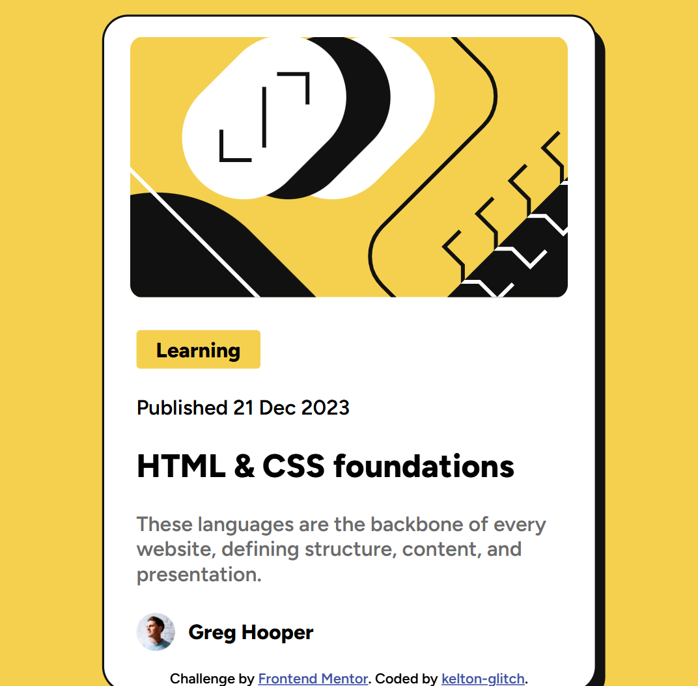

# Frontend Mentor - Blog preview card solution

This is a solution to the [Blog preview card challenge on Frontend Mentor](https://www.frontendmentor.io/challenges/blog-preview-card-ckPaj01IcS). Frontend Mentor challenges help you improve your coding skills by building realistic projects.

## Table of contents

- [Frontend Mentor - Blog preview card solution](#frontend-mentor---blog-preview-card-solution)
  - [Table of contents](#table-of-contents)
  - [Overview](#overview)
    - [The challenge](#the-challenge)
    - [Screenshot](#screenshot)
    - [Links](#links)
  - [My process](#my-process)
    - [Built with](#built-with)
    - [What I learned](#what-i-learned)
  - [Author](#author)

## Overview

### The challenge

Users should be able to:

- See hover and focus states for all interactive elements on the page

### Screenshot



### Links

- Solution URL: [Solution](https://github.com/kelton-glitch/blog-preview-card)
- Live Site URL: [Live site](https://blog-card-review.netlify.app/)

## My process

### Built with

- Semantic HTML5 markup
- CSS custom properties
- Flexbox
- CSS Grid
- Mobile-first workflow

### What I learned

Using `HTML` and `CSS` to do markup sometimes looked like a struggle till I did it myself from scratch and enhoyed it with all the fun that comes together with it. I did a review of some basic ``HTML & CSS concepts`` to help me navigate this task just `HTML and CSS`

```css
.card::before {
        left: 2px;
        top: 4px;
        width: 100%;
        height: calc(100% - 10px);
        border-radius: 15px;
    }
```

Figuring this card out was such a massive relieve especially in order to make it more responsive.

## Author

- Frontend Mentor - [@kelton-glitch](https://www.frontendmentor.io/profile/kelton-glitch)
- Twitter - [@kelton194](https://www.twitter.com/kelton194)
- LinkedIn - [Elton Kamgo Njomo](https://www.linkedin.com/in/elton-kamgo-njomo-89ba66210)
